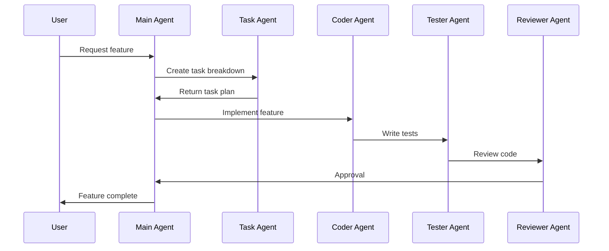
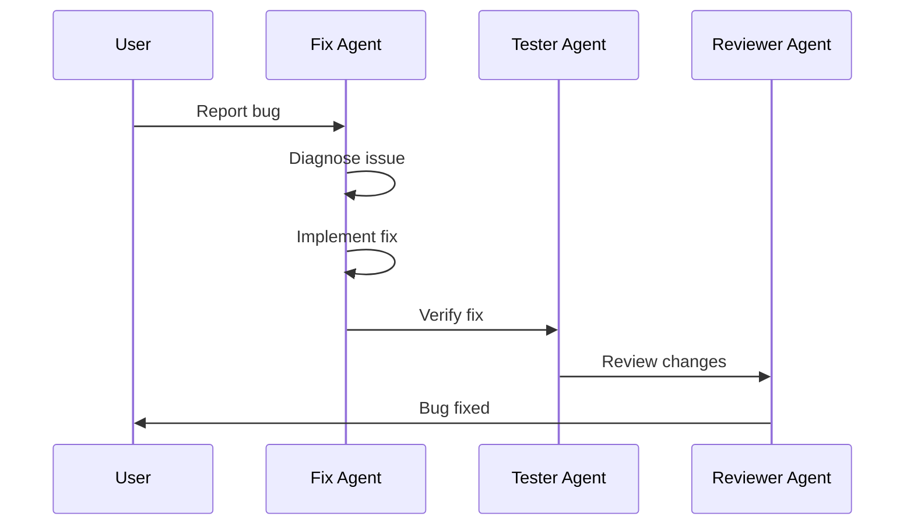

# Claude Multi-Agent System

A comprehensive multi-agent system for software development, featuring specialized agents for different aspects of the development workflow.

## Overview

This agent system provides a coordinated approach to software development tasks, with each agent specializing in specific domains while sharing common context and standards.

### Architecture

```
┌─────────────────────────────────────────────────────┐
│                   Main Agent                        │
│         (Orchestrator & Coordinator)                │
└─────────────────────┬───────────────────────────────┘
                      │
        ┌─────────────┼─────────────┐
        │             │             │
   ┌────▼───┐   ┌────▼───┐   ┌────▼───┐
   │ Task   │   │ Coder  │   │  Fix   │
   │ Agent  │   │ Agent  │   │ Agent  │
   └────────┘   └────────┘   └────────┘
        │             │             │
   ┌────▼───┐   ┌────▼───┐   ┌────▼───┐
   │ UI/UX  │   │ Tester │   │Deployer│
   │ Agent  │   │ Agent  │   │ Agent  │
   └────────┘   └────────┘   └────────┘
        │             │             │
   ┌────▼───┐   ┌────▼───┐   ┌────▼───┐
   │Document│   │Reviewer│   │  Web   │
   │ Agent  │   │ Agent  │   │ Search │
   └────────┘   └────────┘   └────────┘
```

## Available Agents

### Core Agents

#### Main Agent
- **Purpose**: Orchestrates complex tasks and coordinates other agents
- **Capabilities**: Full codebase access, task delegation, decision-making
- **Use Cases**: Complex features, architectural decisions, multi-step workflows

#### Task Agent
- **Purpose**: Task planning, breakdown, and progress tracking
- **Capabilities**: TodoWrite management, dependency analysis, progress monitoring
- **Use Cases**: Project planning, task organization, milestone tracking

#### Coder Agent
- **Purpose**: Feature implementation and code writing
- **Capabilities**: TypeScript, React, Next.js expertise
- **Use Cases**: New features, component development, API integration

### Specialized Agents

#### Fix Agent
- **Purpose**: Debugging and bug resolution
- **Capabilities**: Error diagnosis, minimal fix implementation
- **Use Cases**: Bug fixes, error resolution, debugging

#### UI/UX Agent
- **Purpose**: Interface design and user experience
- **Capabilities**: Responsive design, accessibility, Tailwind CSS
- **Use Cases**: UI implementation, accessibility improvements, responsive layouts

#### Tester Agent
- **Purpose**: Test creation and quality assurance
- **Capabilities**: Jest, React Testing Library, Playwright
- **Use Cases**: Unit tests, integration tests, E2E tests

#### Deployer Agent
- **Purpose**: Deployment and CI/CD management
- **Capabilities**: Vercel deployment, environment management
- **Use Cases**: Production deployment, environment configuration

#### Documenter Agent
- **Purpose**: Documentation creation and maintenance
- **Capabilities**: Technical writing, API documentation
- **Use Cases**: README files, API docs, user guides

#### Reviewer Agent
- **Purpose**: Code review and quality assessment
- **Capabilities**: Security audit, performance review, best practices
- **Use Cases**: Pull request reviews, code quality checks

#### Web Search Agent
- **Purpose**: Online research and information gathering
- **Capabilities**: Web search, documentation lookup
- **Use Cases**: Technical research, library evaluation, troubleshooting

## Quick Start

### 1. Installation

```bash
# Clone the repository
git clone <repository-url>

# Navigate to project
cd <project-directory>

# Copy agent configurations
cp -r ~/.claude/agents /path/to/claude/config/
```

### 2. Basic Usage

#### Using the Main Agent

```bash
# For complex tasks
"Implement user authentication with Appwrite"

# The Main Agent will:
# 1. Break down the task
# 2. Delegate to Coder Agent for implementation
# 3. Use Tester Agent for tests
# 4. Have Reviewer Agent check the code
```

#### Using Specialized Agents Directly

```bash
# Bug fixing
@fix-agent "Fix the login redirect issue"

# UI implementation
@uiux-agent "Create a responsive dashboard layout"

# Testing
@tester-agent "Write tests for the authentication flow"
```

### 3. Configuration

Each agent can be configured through their respective configuration files:

```
~/.claude/agents/
├── <agent-name>/
│   ├── mcp.json       # MCP server configuration
│   ├── context.json   # Context settings
│   └── prompt.md      # Agent-specific instructions
```

## Agent Workflows

### Feature Development



### Bug Fixing



## Skills System

All agents have access to shared skills:

- **nextjs.md**: Next.js expertise
- **typescript.md**: TypeScript knowledge
- **architecture.md**: System design patterns
- **security.md**: Security best practices
- **performance.md**: Optimization techniques
- **accessibility.md**: A11y standards
- And more...

See [Skills Documentation](../../skills/) for details.

## Best Practices

### When to Use Which Agent

| Task Type | Recommended Agent | Reason |
|-----------|------------------|---------|
| New feature | Main Agent | Coordinates multiple aspects |
| Bug fix | Fix Agent | Specialized in debugging |
| UI work | UI/UX Agent | Design expertise |
| Tests | Tester Agent | Testing focus |
| Documentation | Documenter Agent | Writing skills |
| Code review | Reviewer Agent | Quality assessment |
| Research | Web Search Agent | Information gathering |
| Deployment | Deployer Agent | Infrastructure knowledge |

### Coordination Tips

1. **Complex Tasks**: Start with Main Agent
2. **Specific Tasks**: Use specialized agent directly
3. **Multiple Steps**: Main Agent delegates automatically
4. **Unclear Requirements**: Ask for clarification first

## Configuration

### Environment Variables

```bash
# .env
APPWRITE_ENDPOINT=
APPWRITE_PROJECT_ID=
NEXT_PUBLIC_APP_URL=
```

See `.env.example` for complete list.

### MCP Servers

Each agent can use Model Context Protocol servers:

- **filesystem**: File system access
- **git**: Version control operations
- **web-search**: Online research (Web Search Agent)

## Troubleshooting

### Common Issues

**Agent not responding as expected**
- Check agent's `prompt.md` for specific instructions
- Verify MCP servers are configured correctly
- Review `context.json` for context window settings

**Task delegation not working**
- Ensure Main Agent is being used
- Check agent registry is up to date
- Verify specialized agents are available

**Performance issues**
- Reduce context window size in `context.json`
- Limit file patterns in context
- Use more specific agents for focused tasks

## Contributing

### Adding a New Agent

1. Create agent directory: `~/.claude/agents/new-agent/`
2. Add configuration files:
   - `mcp.json`
   - `context.json`
   - `prompt.md`
3. Register in `registry.json`
4. Document in this README

### Adding a New Skill

1. Create skill file: `~/.claude/skills/new-skill.md`
2. Document the expertise area
3. Include code examples
4. Update skills index

## Support

For issues and questions:
- Check [Troubleshooting](#troubleshooting)
- Review agent-specific documentation
- See [Deployment Guide](./DEPLOYMENT.md)
- Consult [Quick Start Guide](./QUICK_START.md)

## License

MIT License - see LICENSE file for details
